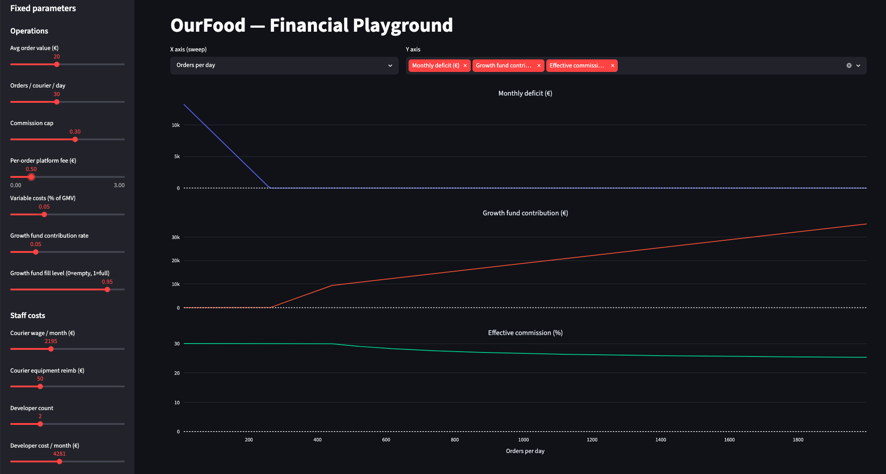

# OurFood — Financial Model

## Definitions

- **GMV** (Gross Merchandise Value) — Total value of all orders placed through
  the platform. The money consumers pay; it flows through the cooperative before
  being split among costs, reserve, and restaurant reimbursement.

- **Commission cap** — A ceiling on the effective platform commission regardless
  of what costs would otherwise require. Set deliberately below incumbent rates
  to attract restaurants even if it means operating at a deficit. Once the
  cooperative reaches sufficient scale the cap becomes irrelevant because the
  natural commission falls below it.

- **Variable costs** — Costs that only arise when orders happen. Currently:
  payment processing fees and fuel/delivery reimbursement per order. Zero if the
  platform has no orders.

- **KTLO** (Keep The Lights On) — Fixed costs incurred regardless of order
  volume. The cooperative must be able to cover these for several months with
  zero revenue before considering the platform viable. Components:
  - _Courier salaries_ — couriers are permanent employees; they cannot be laid
    off and re-hired between months.
  - _Courier equipment reimbursement_ — couriers own their bikes; the
    cooperative reimburses a fixed monthly amount per courier covering broadband
    and a wear/depreciation allowance.
  - _Management & development salaries_ — the core team needed to operate and
    maintain the platform.
  - _Operational expenses_ — servers, legal, accounting, insurance, and other
    fixed overheads.

- **Onboarding cost** — One-time cost per new courier: safety equipment (helmet,
  vest) and a branded delivery trunk. Appears as a capital expenditure during
  growth phases, not as a monthly P&L line.

- **Net surplus** — `GMV − variable costs − KTLO`. The amount available to split
  between the growth fund and restaurant reimbursement. The cooperative targets
  zero accounting profit: all net surplus flows to these two destinations. A
  negative net surplus is an operating deficit that must be covered by seed
  funding.

- **Operating deficit** — Arises in the early phase when KTLO and variable costs
  exceed the revenue the cooperative retains under the commission cap.
  Represents the monthly funding requirement from seed capital.

- **Growth fund** — A capital pool built from net surplus at up to 5% per month.
  Used for expansion capex: new courier onboarding (safety equipment, branded
  trunk), new city nodes, and other investments that support growth. Not an
  emergency liquidity buffer — the cooperative is expected to always have some
  order volume. Contributions stop once the fund reaches the growth fund target;
  after that, the full net surplus goes to restaurants and the effective
  commission falls accordingly. The growth fund is a discretionary management
  policy governed by the articles of association (the cooperative is designed to
  have zero accounting profit, so there is no statutory 5%-of-profit
  obligation).

- **Growth fund target** — Three months of KTLO, used as a sizing heuristic. Not
  a literal scenario of zero orders for three months — just a convenient scale
  reference that gives the fund enough capital to support meaningful expansion
  without over-accumulating.

- **Restaurant reimbursement** — The share of net surplus returned to
  restaurants after the reserve contribution, proportional to each restaurant's
  order volume over the period. This is the cooperative's primary value
  proposition: after covering costs and building the reserve, everything goes
  back to the restaurants.

- **Effective platform commission** — `(GMV − restaurant reimbursement) / GMV`.
  What restaurants effectively pay for the platform's services. Not a pre-set
  fee — it is the result of the cost structure and the current reserve
  contribution rate. It decreases as order volume grows and falls to its floor
  once the reserve is fully funded.

- **Platform fee per order**: A small fee that is added on top of the order
  price intended to cover the platform's cost. Not having a platform fee would
  be give us a competitive advantage over other platforms but having even a
  small platform fee makes the break-event point a lot easier to achieve. It is
  not decided yet whether we will have one for a safety margin at the beginning
  and pledge to remove it once things stabilize or if we will start without it
  having it as an option to help us out if things don't go well initially.

## Restaurant reimbursement and growth fund contribution analysis

To simplify things, let's assume it's the end of the month and so far we've been
collecting the GMV and are about to pay what we owe to restaurants, employees,
providers etc. In reality we will probably make this calculation and reimburse
restaurants daily but this approach simplifies the math.

1. We calculate our variable costs and KTLO values for the month and subtract
   them from GMV. This gives us the net surplus for the month.

   `net_surplus = GMV - KTLO - variable_costs`

2. We then calculate the minimum restaurant reimbursement based on the GMV and
   restaurant commission cap.

   `minimum_restaurant_reimbursement = (1 - restaurant_commision_cap) x GMV`

3. If net surplus is negative or smaller than the minimum restaurant
   reimbursement, we use the growth fund and GMV to pay our obligations, call
   the amount we drew from the growth fund our deficit and call it a day.

   ```python
   if net_surplus < minimum_restaurant_reimbursement:
       restaurant_reimbursement = minimum_restaurant_reimbursement
       restaurant_commission = restaurant_commision_cap
       deficit =   KTLO
                 + variable_costs
                 + restaurant_reimbursement
                 - GMV
   ```

   It is normal to operate at a deficit in the early phase while we build up
   order volume and break even. The main goal of the exercise is to figure out
   how to break even.

4. When net surplus is larger than the minimum restaurant reimbursement, we
   start using the difference to contribute to the growth fund. The growth fund
   contribution is capped to the minimum of:
   - The amount required to reach the growth fund balance target which is
     defined as `3 x KTLO`

   - 5% of net surplus

   ```python
   if net_surplus > minimum_restaurant_reimbursement:
       growth_fund_contribution = min(
           net_surplus - minimum_restaurant_reimbursement,
           3 * KTLO - growth_fund_balance,
           net_surplus * 0.05  # 5%,
       )
   else:
       growth_fund_contribution = 0
   ```

5. When GMV is big enough that there is leftover in the net surplus after having
   deducted the growth fund contribution, we give the remainder to the
   restaurants, lowering their effective commission beyond the cap.

   ```python
   if net_surplus > growth_fund_contribution:
       restaurant_reimbursement = net_surplus - growth_fund_contribution
       restaurant_commission = (GMV - restaurant_reimbursement) / GMV
   ```

This is how the amounts are calculated. It will likely not going to be the story
we tell the accounting authorities. The more likely story is:

- Restaurants invoice customers for the full amount
- We collect money on the restaurants' behalf
- We invoice restaurants for our services, setting as the amount the difference
  between the original orders' amount and their actual reimbursement
- We reimburse the restaurants

## Analysis of GMV and courier count

- **Total restaurant count** in area: The number of restaurants whose
  merchandise is compatible with the platform. Using Patras as our case study,
  we can estimate this at 1200. This is derived from:
  - Estimate of total restaurants in Patras: 2000
  - We assume that some (say, 800) will never join a delivery platform because
    their merchandise is not compatible with an online delivery platform (family
    restaurants, tavernas etc)
  - Restaurants already collaborating with a delivery platform: ~585
  - We assume that a lot of them have not joined because of incumbent fees and
    will join us because we will offer lower ones.

- **Restaurant adoption**: Ratio of restaurants in our platform compared to
  total (between zero and one). This has a big uncertainty because it depends on
  persuasion and marketing; we will use different values for different
  experiments.

- **Total orders per restaurant per day**: Estimate for Patras: 20

- **Order adoption**: Average ratio of orders placed through our platform
  compared to total (phone or competitor) (between zero and one). This has a
  similar uncertainty to restaurant adoption for the same reasons; we will use
  different values for different experiments.

Using these, we can arrive at **orders per day** with:

```python
restaurant_count = total_restaurant_count * restaurant_adoption
orders_per_restaurant_per_day = total_orders_per_restaurant_per_day * user_adoption
orders_per_day = restaurant_count * orders_per_restaurant_per_day
```

- **Average order value**: Estimate: €18. Given that each order contributes to
  our expenses regardless of its value, small orders are brutal to our business
  model. As our experiments show, high values help a lot (but are not as crucial
  as _courier efficiency_). Setting minimum order value, especially during the
  early phase, could be really helpful to push this value higher.

  Using this, we can calculate GMV:

  ```python
  gmv_per_day = orders_per_day * avg_order_value
  gmv_per_month = gmv_per_day * 30
  ```

- **Courier time ratio**: Taking 5-day work weeks and 22 days/year PTO, how much
  of each courier contributes to a single working day on average. Calculated as
  `(365 - 22) * 5 / 7 / 365 = 0.67123`. Since this is almost `2/3`, this means
  that if we hire 300 couriers, we will have 200 active on any given day.

- **Courier efficiency**, orders serviced by a single courier during an 8-hour
  shift: Based on preliminary analysis, this can range from 20-35. The value
  depends on many factors, including:
  - Population density
  - Distance between restaurant and consumer
  - Order frequency (this means that this value can be high during peak hours,
    low otherwise)
  - Ability to batch multiple orders in the same route

  Using this, we can calculate the number of couriers we will need to hire to
  service our order volume:

  ```python
  courier_count = orders_per_day / orders_per_courier_per_day / courier_time_ratio
  ```

  In our experiments, the courier count is not an input variable but an output.
  This suggests that we can magically hire couriers needed to cover our order
  volume instantly. This is obviously not realistic but it allows us to
  understand the relationship between order volume and courier count without
  having to model the hiring process. In reality, we will try to estimate the
  order count for each month and hire slightly above our needs to ensure we can
  cover the demand.

  This value is arguably the most important in determining the viability of the
  platform. With low values, deficit **grows** with respect to order count; the
  revenue each courier brings does not even cover their own wage. With high
  values, viability is achieved even with low order counts, assuming we can
  magically scale courier count to order count.

## Cost breakdown

### KTLO

For our analysis, we define 3 employee classes: **couriers**, **software
developers** and **operations managers**.

- Per courier:

  In Greece, the employer is responsible for two things that are invisible to
  the employee: withholding the employee's share of social security and income
  tax from the gross salary and remitting both to the state on their behalf. The
  employee sees only the **clean wage** (καθαρός μισθός) — what arrives in their
  account. On top of this, the employer pays their own social security
  contribution directly to the state, calculated as a percentage of gross salary
  and not deducted from the employee. Greek law also mandates three annual
  bonuses: a full month's salary at Christmas, half a month at Easter, and half
  a month in summer — two extra months' salary per year in total. These are a
  legal obligation, not optional.

  The table below uses a target **clean wage of ~€1,100/month**, which is
  meaningfully above the minimum wage and reflects the cooperative's commitment
  to fair compensation. Exact rates should be verified with a Greek accountant.

  _From the courier's perspective:_

  |                                   | Rate            |     Monthly | Monthly incl. bonuses (×14/12) |      Yearly |
  | --------------------------------- | --------------- | ----------: | -----------------------------: | ----------: |
  | Gross salary                      | —               |      €1,500 |                         €1,750 |     €21,000 |
  | Employee social security          | ~13.9% of gross |       −€208 |                          −€243 |     −€2,916 |
  | Income tax (withheld by employer) | ~12% effective  |       −€180 |                          −€210 |     −€2,520 |
  | **Clean wage**                    |                 | **~€1,112** |                    **~€1,297** | **€15,564** |

  _From the cooperative's perspective:_

  |                                      | Rate            |    Monthly | Monthly incl. bonuses (×14/12) |      Yearly |
  | ------------------------------------ | --------------- | ---------: | -----------------------------: | ----------: |
  | Gross salary                         | —               |     €1,500 |                         €1,750 |     €21,000 |
  | Employer social security             | ~22.3% of gross |       €334 |                           €390 |      €4,680 |
  | **Salary cost subtotal**             |                 | **€1,834** |                     **€2,140** | **€25,680** |
  | Equipment reimbursement (SIM + wear) | fixed           |        €55 |                            €55 |        €660 |
  | **Total per courier**                |                 | **€1,889** |                     **€2,195** | **€26,340** |

  _Note:_ income tax rates are progressive (9% / 22% / 28% / 36% / 44%) and a
  tax credit applies at lower income levels. The 12% effective rate above is an
  estimate for this income bracket. The social security rates and tax brackets
  should be confirmed with an accountant before using these numbers in any
  formal document.

- Per developer: assumed gross €3,500/month (€49,000/year). Effective income tax
  ~21% at this bracket.

  _From the developer's perspective:_

  |                                   | Rate            |    Monthly | Monthly incl. bonuses (×14/12) |      Yearly |
  | --------------------------------- | --------------- | ---------: | -----------------------------: | ----------: |
  | Gross salary                      | —               |     €3,500 |                         €4,083 |     €49,000 |
  | Employee social security          | ~13.9% of gross |      −€485 |                          −€566 |     −€6,790 |
  | Income tax (withheld by employer) | ~21% effective  |      −€748 |                          −€873 |    −€10,470 |
  | **Clean wage**                    |                 | **€2,267** |                     **€2,644** | **€31,740** |

  _From the cooperative's perspective:_

  |                          | Rate            |    Monthly | Monthly incl. bonuses (×14/12) |      Yearly |
  | ------------------------ | --------------- | ---------: | -----------------------------: | ----------: |
  | Gross salary             | —               |     €3,500 |                         €4,083 |     €49,000 |
  | Employer social security | ~22.3% of gross |       €781 |                           €911 |     €10,927 |
  | **Total per developer**  |                 | **€4,281** |                     **€4,994** | **€59,927** |

  It may seem unfair to offer almost double a courier's wage to developers but
  if we don't hire competitively, we won't be able to attract developers at all.

- Per operations manager: assumed gross €2,700/month (€37,800/year). Effective
  income tax ~18% at this bracket.

  _From the operations manager's perspective:_

  |                                   | Rate            |    Monthly | Monthly incl. bonuses (×14/12) |      Yearly |
  | --------------------------------- | --------------- | ---------: | -----------------------------: | ----------: |
  | Gross salary                      | —               |     €2,700 |                         €3,150 |     €37,800 |
  | Employee social security          | ~13.9% of gross |      −€375 |                          −€437 |     −€5,248 |
  | Income tax (withheld by employer) | ~18% effective  |      −€487 |                          −€568 |     −€6,818 |
  | **Clean wage**                    |                 | **€1,838** |                     **€2,145** | **€25,734** |

  _From the cooperative's perspective:_

  |                                  | Rate            |    Monthly | Monthly incl. bonuses (×14/12) |      Yearly |
  | -------------------------------- | --------------- | ---------: | -----------------------------: | ----------: |
  | Gross salary                     | —               |     €2,700 |                         €3,150 |     €37,800 |
  | Employer social security         | ~22.3% of gross |       €602 |                           €702 |      €8,429 |
  | **Total per operations manager** |                 | **€3,302** |                     **€3,852** | **€46,229** |

- Operational:

  |                                           |    Monthly | Notes                                                                                                                 |
  | ----------------------------------------- | ---------: | --------------------------------------------------------------------------------------------------------------------- |
  | Servers (GCP, AWS or similar)             |       €400 | Scales with traffic; ~€150 at launch                                                                                  |
  | Routing / maps API                        |         €0 | **Must** use open-source (OSRM + OpenStreetMap); Google Maps would cost €1,500+/month at scale                        |
  | Twilio (SMS, phone numbers)               |        €50 | Used for sign-up OTP only, not per-order notifications (~€0.07/SMS × new sign-ups/month); tapers as user base matures |
  | Sentry (error monitoring)                 |        €25 | Team plan; free tier may suffice at launch                                                                            |
  | Intercom (customer support)               |        €75 | Starter plan; cheaper alternatives (Crisp, Freshdesk) exist                                                           |
  | Mixpanel (analytics)                      |        €30 | Free tier sufficient at launch                                                                                        |
  | Transactional email (Postmark / SendGrid) |        €20 | Receipts, welcome emails, password resets; free tier sufficient at launch                                             |
  | Apple Developer Program                   |         €9 | €99/year; mandatory to publish on App Store                                                                           |
  | Google Play                               |         €0 | €25 one-time fee; negligible                                                                                          |
  | E-signing (DocuSign / HelloSign)          |        €25 | Courier and restaurant onboarding contracts                                                                           |
  | Accounting services                       |       €350 | Greek certified accountant; ΚοινΣΕπ may require a specialist                                                          |
  | Legal services                            |       €200 | Ongoing retainer; significantly higher in year 1                                                                      |
  | Office / warehouse rent                   |       €600 | Small shared space for team + equipment storage; avoidable if fully remote                                            |
  | Utilities (electricity, water, internet)  |       €120 | Only if office                                                                                                        |
  | **Total**                                 | **€1,904** |                                                                                                                       |

### Variable costs

- Payment processing fees: Stripe, Adyen or similar
- Gas reimbursement: proportional to distance covered (calculated by the
  software)

We can estimate variable costs to be around 5% of GMV.

### Courier onboarding

One-time capital expenditure per new courier. Does not appear in the monthly P&L
but is drawn from the growth fund.

| Item                     |      Low |  Central |     High |
| ------------------------ | -------: | -------: | -------: |
| Delivery trunk (top box) |      €80 |     €130 |     €180 |
| Helmet                   |      €50 |      €90 |     €140 |
| Phone mount              |      €10 |      €20 |      €35 |
| Hi-vis jacket / vest set |      €30 |      €55 |      €80 |
| **Total per courier**    | **€170** | **€295** | **€435** |

_Safety clothing vs. monthly equipment reimbursement:_ durable items (trunk,
helmet, jacket) are treated as capital expenditure here; consumables and wear
allowance (gloves, bag liners, phone screen replacements) are covered by the
€55/month equipment reimbursement.

**Planning figure: €320/courier.** At the early phase (3–5 couriers) this is
~€1,000–1,600 from the growth fund — negligible. It only becomes material during
rapid expansion (e.g. +20 couriers in a month = ~€6,400).

It is likely that we will have to build a stock of these items to get better
prices and to be able to hire new couriers quickly.

## The playground

The playground implements everything we said so far as code. It allows you to
see how input variables (like "Orders per day", "Avg order value" etc) affect
output variables (like "GMV", "Deficit" etc). You pick one of the input
variables as the x-axis, set values for the rest of the input variables and pick
which output variables to plot as graphs.

You can run the playground by running:

```sh
uvx --with plotly --with numpy streamlit run https://github.com/kbairak/OurFood/raw/refs/heads/main/docs/financials/playground.py
```

If you have [uv](https://docs.astral.sh/uv/) installed.

Here is a typical screenshot:


What this tells us:

- GMV rises proportionally to orders per day
- Until we hit ~350 orders per day, we run at a deficit
- When we break even, we start contributing to the growth fund
- At ~730 orders per day, the difference between the net surplus and the minimum
  restaurant contribution reaches 5% of net surplus, which means that we
  decrease the rate of growth fund contribution and offer restaurant
  reimbursement larger than the minimum, lowering the effective commission

Here is what happens if we provide higher values for "average order value" and
"orders per courier per day":


Mostly same as before, but:

- The break-even point is at ~150 orders per day
- The effective commission starts falling at ~200 orders per day

If we set worse values for these variables:


Then deficit grows with daily orders. This would be catastrophic.

### Effects of platform fee

The screenshots above have a zero platform fee. Here is what happens if we set a
€0.50 platform fee per order:



- The break even point drops from ~350 orders/day to ~250 orders/day
- The effect is significant which suggests that it is a valuable tool to help
  improve the margins

Here is what happens if we set a €1.00 platform fee per order:


- The break even point drops further to ~200 orders/day
- The drop is not as significant, which suggests that there are diminishing
  returns to further increasing the platform fee

## Invoices, VAT

> This needs further research.

The parties in a single €30 order:

| Party      | Role                                             |
| ---------- | ------------------------------------------------ |
| Consumer   | Pays for food                                    |
| Restaurant | Prepares food                                    |
| Courier    | Delivers food (salaried employee, not per-order) |
| Platform   | Collects payment, orchestrates delivery          |
| Stripe     | Processes card payment                           |

The money flow:

1. Consumer pays €30 to the platform via Stripe
2. Stripe deducts €0.87 (2.9%) → platform receives €29.13
3. Restaurant prepares and hands over the order
4. Courier delivers (already on salary — no per-order payment)
5. At end of period, platform remits the restaurant's share

The invoicing question is where it gets interesting — and depends on a choice.

Option A — Platform as principal:

- Platform "buys" food from restaurant, "sells" it to consumer
- Consumer receives invoice from platform for €30
- Restaurant invoices platform for the food (e.g. €26.07 + 13% VAT)
- Platform invoices no one for commission — it's implicit in the margin
- Platform's revenue for VAT purposes = the full €30 (complex)

Option B — Platform as agent:

- Consumer receives invoice from restaurant for €30 (platform just facilitates
  payment)
- Platform invoices restaurant for its service fee (e.g. €3.93 + 24% VAT)
- Restaurant's revenue = €30; platform's revenue = €3.93 commission

Option B is probably cleaner for this cooperative because it matches the
Alternative Flow framing: the cooperative provides a delivery service to
restaurants and charges them for it. The restaurant-consumer relationship is
direct. The commission invoice (with 24% VAT) is straightforward for the
accountant.

What definitely needs a Greek accountant:

- Whether the platform can operate as agent for VAT purposes
- Whether the consumer receipt can be issued by the restaurant through the
  platform
- How VAT is reported on the restaurant's share remittance
- Whether the food's 13% VAT rate is the restaurant's liability or the
  platform's
